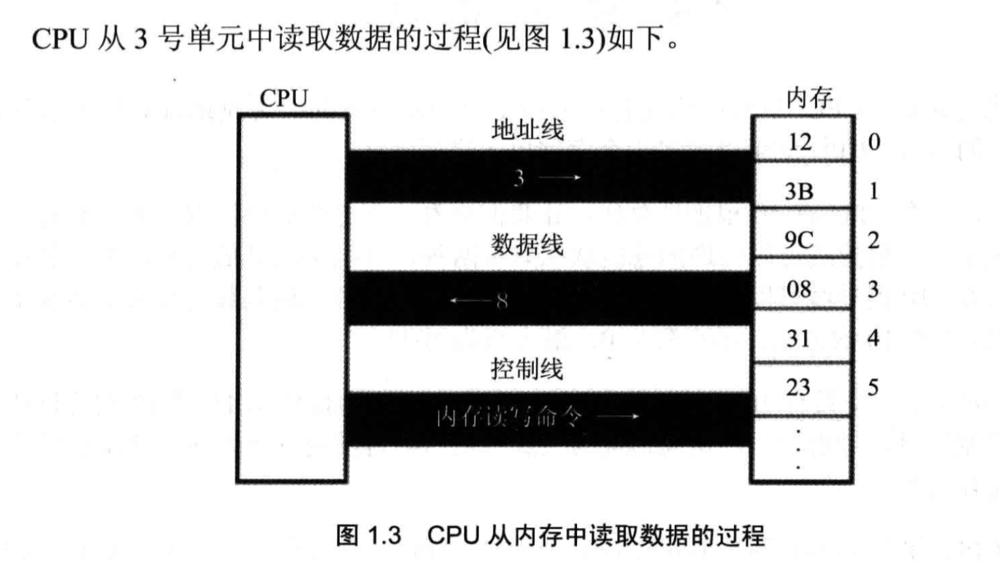
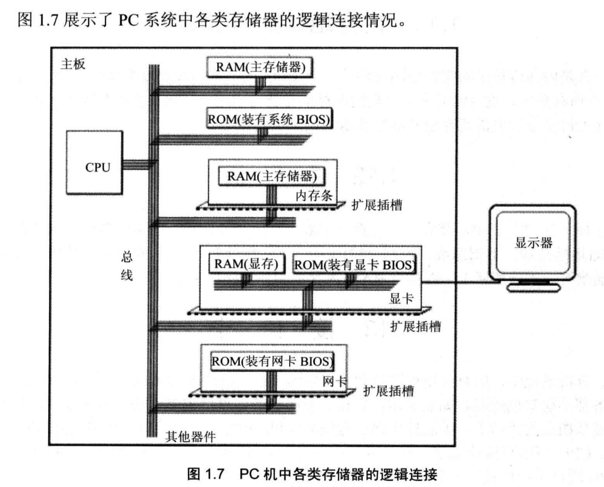
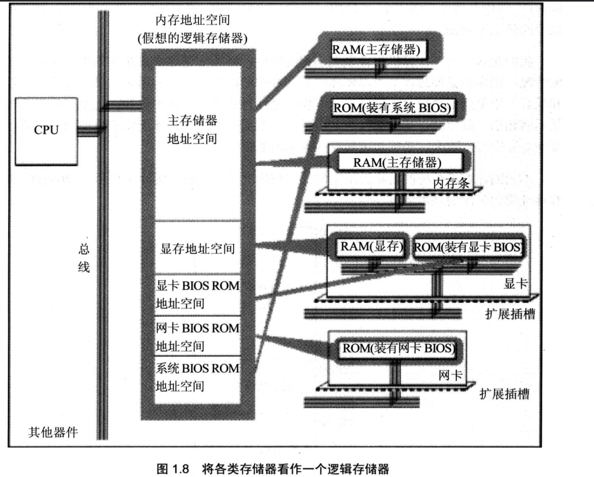

# 基础知识

汇编语言的主体是汇编指令。汇编指令是机器指令便于记忆的书写格式。

### 总线

在计算机中专门有连接 CPU 和其他芯片的导线，通常称为总线。总线从逻辑上分为 3 类，地址总线、控制总线和数据总线。

- 地址总线的宽度决定了 CPU 的寻址能力；
- 数据总线的宽度决定了 CPU 与其他期间进行数据传送时的一次数据传送量；
- 控制总线的宽度决定了 CPU 对系统中其他器件的控制能力。

CPU 从 3 号单元中读取数据的过程：

1. CPU 通过地址线将地址信息 3 发出。
2. CPU 通过控制线发出内存读命令，选中存储器芯片，通知它要读取数据。
3. 存储器将 3 号单元的数据 8 通过数据线送入 CPU。

### 存储器

存储器分为两类：随机存储器（RAM）和只读存储器（ROM）。随机存储器可读可写，但必须单点存储，关机后存储的内容丢失。只读存储器只能读取不能写入，关机后其中的内容不丢失。

下图展示了 PC 系统中各类存储器的逻辑连接情况。

在下图中，所有的物理存储器被看做一个由若干存储单元组成的逻辑存储器，每个物理存储器在这个逻辑存储器中占有一个地址段，即一段地址空间。CPU 在这段地址空间中读写数据，实际上就是在相对应的物理存储器中读写数据。

