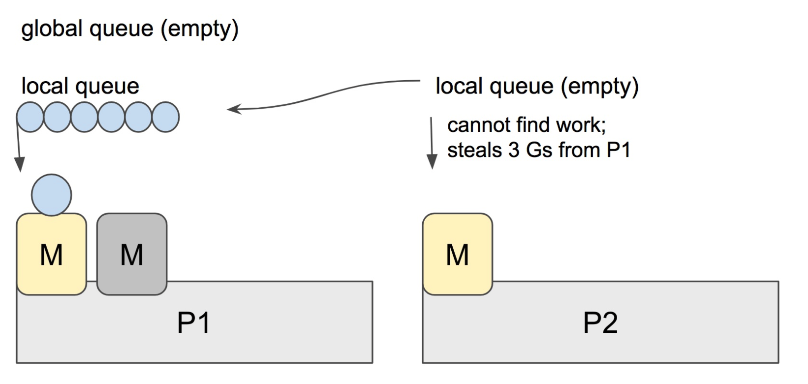
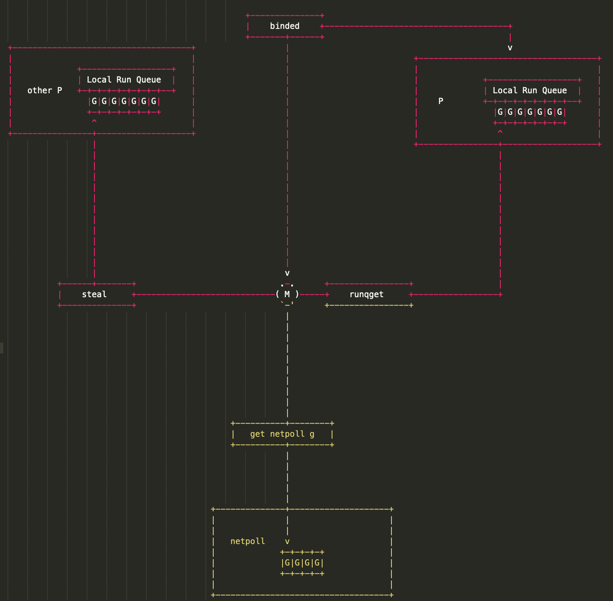
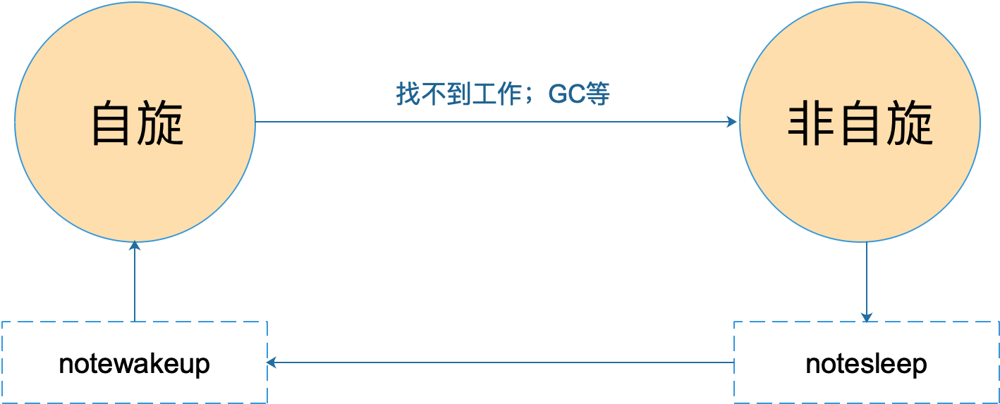

# 6. Go 并发调度

术语：

- G: **G**oroutine，即我们在 Go 程序中使用 `go` 关键字创建的执行体；
- M: **M**achine，或 worker thread，即传统意义上进程的线程；
- P: **P**rocessor，即一种人为抽象的、用于执行 Go 代码被要求局部资源。只有当 M 与一个 P 关联后才能执行 Go 代码。除非 M 发生阻塞或在进行系统调用时间过长时，没有与之关联的 P。

Go调度器有两个不同的运行队列：

- GRQ，全局运行队列，尚未分配给 P 的 G
- LRQ，本地运行队列，每个 P 都有一个 LRQ，用于管理分配给 P 执行的 G

## 6.1 工作窃取式调度

Go scheduler 的职责就是将所有处于 runnable 的 goroutines 均匀分布到在 P 上运行的 M。

当一个 P 发现自己的 LRQ 已经没有 G 时，会从其他 P “偷” 一些 G 来运行。看看这是什么精神！自己的工作做完了，为了全局的利益，主动为别人分担。这被称为 `Work-stealing`，Go 从 1.1 开始实现。

Go scheduler 使用 M:N 模型，在任一时刻，M 个 goroutines（G） 要分配到 N 个内核线程（M），这些 M 跑在个数最多为 GOMAXPROCS 的逻辑处理器（P）上。每个 M 必须依附于一个 P，每个 P 在同一时刻只能运行一个 M。如果 P 上的 M 阻塞了，那它就需要其他的 M 来运行 P 的 LRQ 里的 goroutines。


实际上，Go scheduler 每一轮调度要做的工作就是找到处于 runnable 的 goroutines，并执行它。找的顺序如下：

```go
runtime.schedule() {
    // only 1/61 of the time, check the global runnable queue for a G.
    // if not found, check the local queue.
    // if not found,
    //     try to steal from other Ps.
    //     if not, check the global runnable queue.
    //     if not found, poll network.
}
```

找到一个可执行的 goroutine 后，就会一直执行下去，直到被阻塞。

当 P2 上的一个 G 执行结束，它就会去 LRQ 获取下一个 G 来执行。如果 LRQ 已经空了，就是说本地可运行队列已经没有 G 需要执行，并且这时 GRQ 也没有 G 了。这时，P2 会随机选择一个 P（称为 P1），P2 会从 P1 的 LRQ “偷”过来一半的 G。



这样做的好处是，有更多的 P 可以一起工作，加速执行完所有的 G。


## 6.2 GPM 是什么

G、P、M 是 Go 调度器的三个核心组件，各司其职。在它们精密地配合下，Go 调度器得以高效运转，这也是 Go 天然支持高并发的内在动力。今天这篇文章我们来深入理解 GPM 模型。

先看 G，取 goroutine 的首字母，主要保存 goroutine 的一些状态信息以及 CPU 的一些寄存器的值，例如 IP 寄存器，以便在轮到本 goroutine 执行时，CPU 知道要从哪一条指令处开始执行。

> 当 goroutine 被调离 CPU 时，调度器负责把 CPU 寄存器的值保存在 g 对象的成员变量之中。
>
> 当 goroutine 被调度起来运行时，调度器又负责把 g 对象的成员变量所保存的寄存器值恢复到 CPU 的寄存器。

再来看 M，取 machine 的首字母，它代表一个工作线程，或者说系统线程。G 需要调度到 M 上才能运行，M 是真正工作的人。结构体 m 就是我们常说的 M，它保存了 M 自身使用的栈信息、当前正在 M 上执行的 G 信息、与之绑定的 P 信息……

当 M 没有工作可做的时候，在它休眠前，会“自旋”地来找工作：检查全局队列，查看 network poller，试图执行 gc 任务，或者“偷”工作。

再来看 P，取 processor 的首字母，为 M 的执行提供“上下文”，保存 M 执行 G 时的一些资源，例如本地可运行 G 队列，memeory cache 等。

一个 M 只有绑定 P 才能执行 goroutine，当 M 被阻塞时，整个 P 会被传递给其他 M ，或者说整个 P 被接管。

GPM 三足鼎力，共同成就 Go scheduler。G 需要在 M 上才能运行，M 依赖 P 提供的资源，P 则持有待运行的 G。你中有我，我中有你。

描述三者的关系：



M 会从与它绑定的 P 的本地队列获取可运行的 G，也会从 network poller 里获取可运行的 G，还会从其他 P 偷 G。

最后我们从宏观上总结一下 GPM，这篇文章尝试从它们的状态流转角度总结。

首先是 G 的状态流转：


说明一下，上图省略了一些垃圾回收的状态。

接着是 P 的状态流转:


通常情况下（在程序运行时不调整 P 的个数），P 只会在上图中的四种状态下进行切换。 当程序刚开始运行进行初始化时，所有的 P 都处于 `_Pgcstop` 状态， 随着 P 的初始化（`runtime.procresize`），会被置于 `_Pidle`。

当 M 需要运行时，会 `runtime.acquirep` 来使 P 变成 `Prunning` 状态，并通过 `runtime.releasep` 来释放。

当 G 执行时需要进入系统调用，P 会被设置为 `_Psyscall`， 如果这个时候被系统监控抢夺（`runtime.retake`），则 P 会被重新修改为 `_Pidle`。

如果在程序运行中发生 `GC`，则 P 会被设置为 `_Pgcstop`， 并在 `runtime.startTheWorld` 时重新调整为 `_Prunning`。

最后，我们来看 M 的状态变化：



M 只有自旋和非自旋两种状态。自旋的时候，会努力找工作；找不到的时候会进入非自旋状态，之后会休眠，直到有工作需要处理时，被其他工作线程唤醒，又进入自旋状态。


以下内容来自《Go语言原本》

任何时候当就绪一个 G、也存在一个空闲的 P 时，都复始一个额外的线程，不进行切换。

因为这个额外线程会在没有检查任何工作的情况下立即进行暂止，最终导致大量 M 的暂止和复始行为，产生大量开销。

基于以上考虑，目前的 Go 的调度器实现中设计了工作线程的**自旋（spinning）状态**：

1. 如果一个工作线程的本地队列、全局运行队列或网络轮询器中均没有可调度的任务，则该线程成为自旋线程；
2. 满足该条件、被复始的线程也被称为自旋线程，对于这种线程，运行时不做任何事情。

自旋线程在进行暂止之前，会尝试从任务队列中寻找任务。当发现任务时，则会切换成非自旋状态， 开始执行 Goroutine。而找到不到任务时，则进行暂止。

当一个 Goroutine 准备就绪时，会首先检查自旋线程的数量，而不是去复始一个新的线程。

如果最后一个自旋线程发现工作并且停止自旋时，则复始一个新的自旋线程。 这个方法消除了不合理的线程复始峰值，且同时保证最终的最大 CPU 并行度利用率。

我们可以通过下图来直观理解工作线程的状态转换：

```
  如果存在空闲的 P，且存在暂止的 M，并就绪 G
          +------+
          v      |
执行 --> 自旋 --> 暂止
 ^        |
 +--------+
  如果发现工作
```

总的来说，调度器的方式可以概括为： **如果存在一个空闲的 P 并且没有自旋状态的工作线程 M，则当就绪一个 G 时，就复始一个额外的线程 M。** 这个方法消除了不合理的线程复始峰值，且同时保证最终的最大 CPU 并行度利用率。

这种设计的实现复杂性表现在进行自旋与非自旋线程状态转换时必须非常小心。 这种转换在提交一个新的 G 时发生竞争，最终导致任何一个工作线程都需要暂止对方。 如果双方均发生失败，则会以半静态 CPU 利用不足而结束调度。

因此，就绪一个 G 的通用流程为：

- 提交一个 G 到 per-P 的本地工作队列
- 执行 StoreLoad 风格的写屏障
- 检查 `sched.nmspinning` 数量

而从自旋到非自旋转换的一般流程为：

- 减少 `nmspinning` 的数量
- 执行 StoreLoad 风格的写屏障
- 在所有 per-P 本地任务队列检查新的工作

当然，此种复杂性在全局任务队列对全局队列并不适用的，因为当给一个全局队列提交工作时， 不进行线程的复始操作。