# 浏览器生成消息-探索浏览器内部

## 1.1 生成 HTTP 请求消息

### URL

浏览器是一个具备多种客户端功能的综合性客户端软件。

如下图，根据访问目标的不同，URL的写法也会不同。例如在访问Web服务器和FTP服务器时，URL中会包含服务器的域名和要访问的文件的路径名等，而发邮件的URL则包含收件人的邮件地址。此外，根据需要，URL中还会包含用户名、密码、服务器端口号等信息。

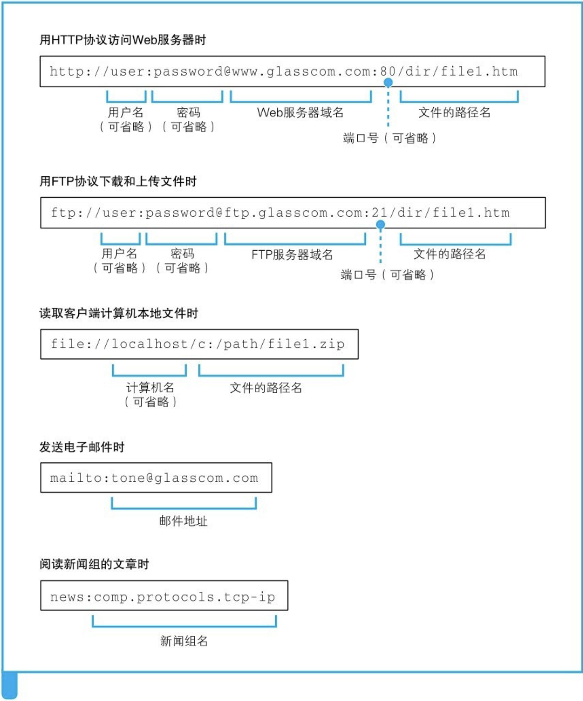

### 解析 URL

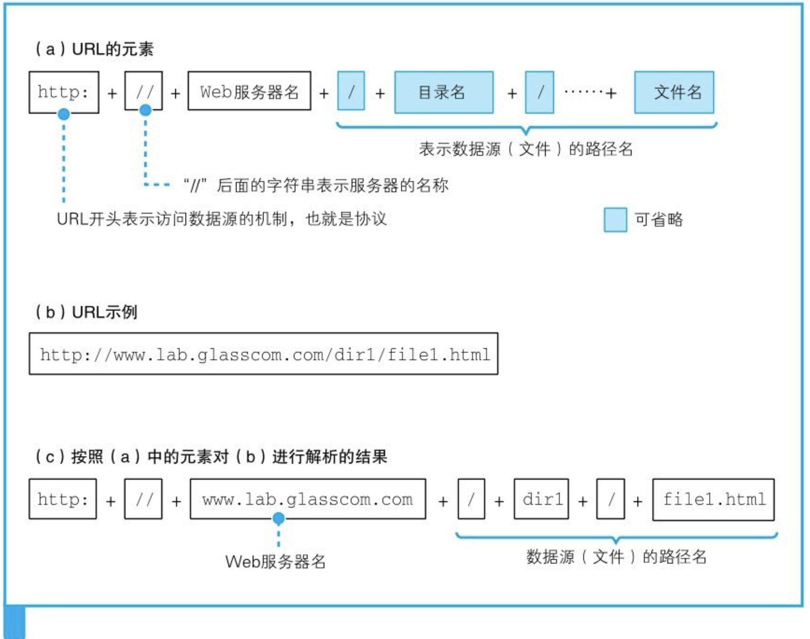

### HTTP 协议

HTTP协议定义了客户端和服务器之间交互的消息内容和步骤，其基本思路非常简单。首先，客户端会向服务器发送请求消息。收到请求消息之后，Web服务器会对其中的内容进行解析，通过URI和方法来判断“对什么”“进行怎样的操作”，并根据这些要求来完成自己的工作，然后将结果存放在响应消息中。

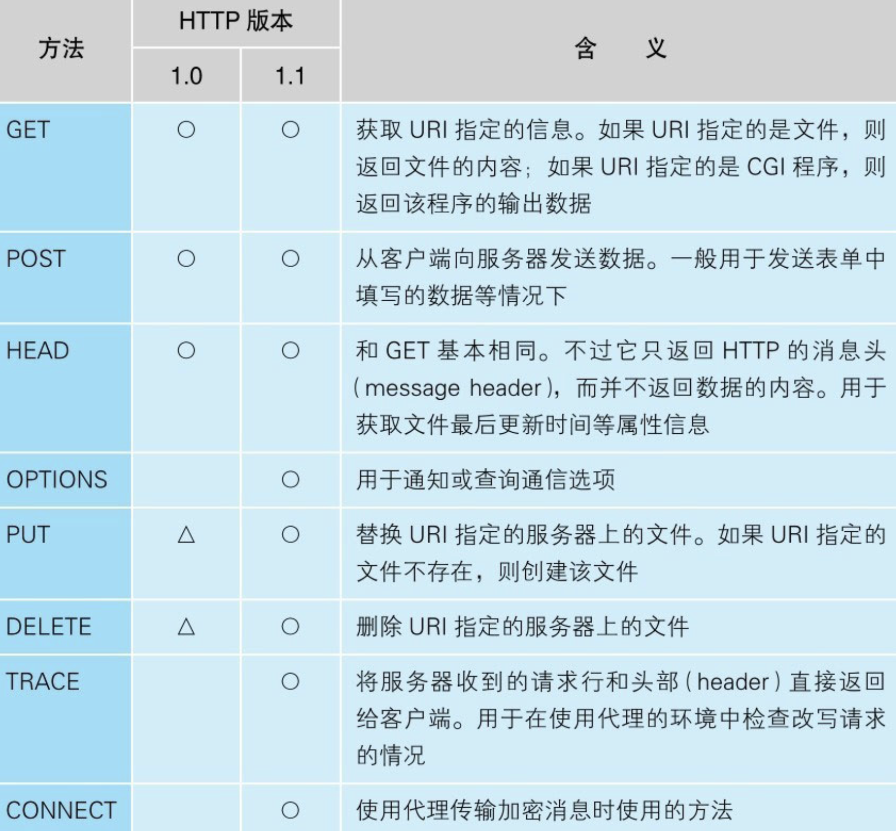

○：在该版本的规格中定义的项目。△：并非正式规格，而是在规格书附录（Appendix）中定义的附加功能。

### HTTP 消息

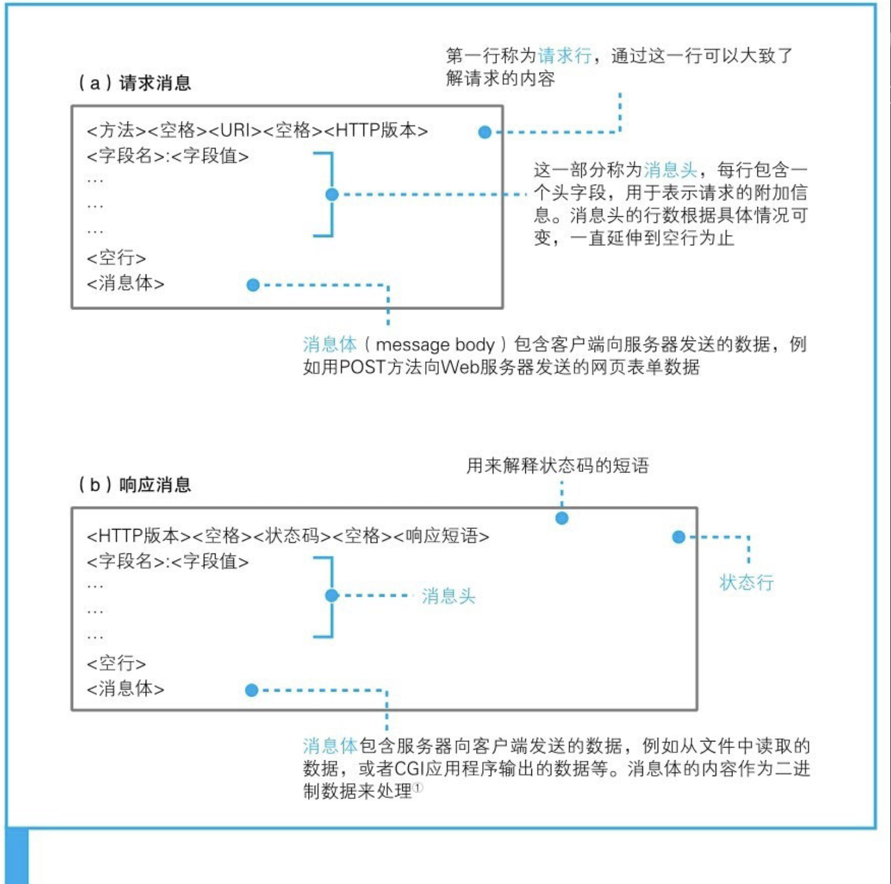

#### 消息头

消息头的规格中定义了很多项目，如日期、客户端支持的数据类型、语言、压缩格式、客户端和服务器的软件名称和版本、数据有效期和最后更新时间等。

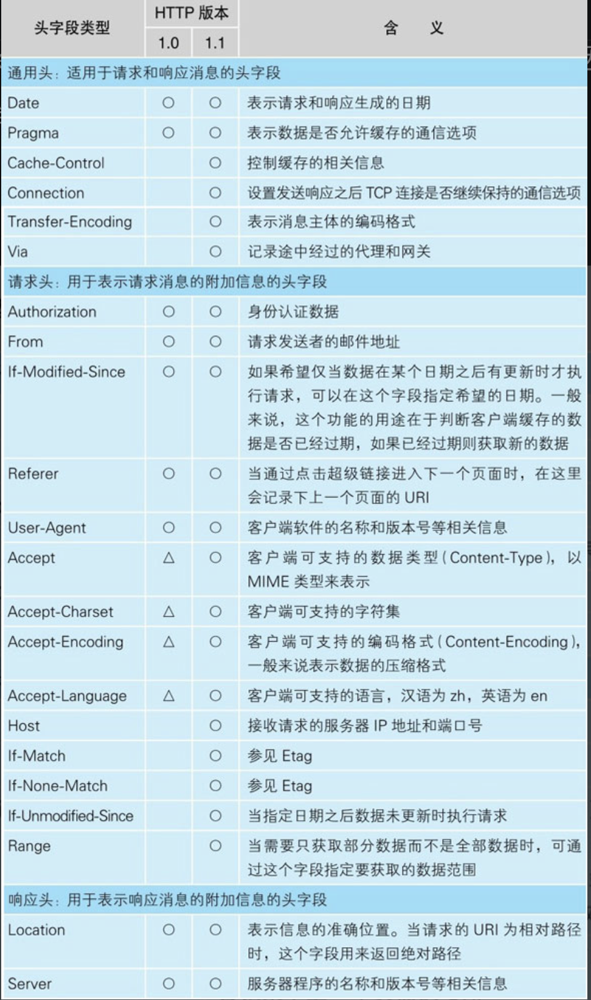

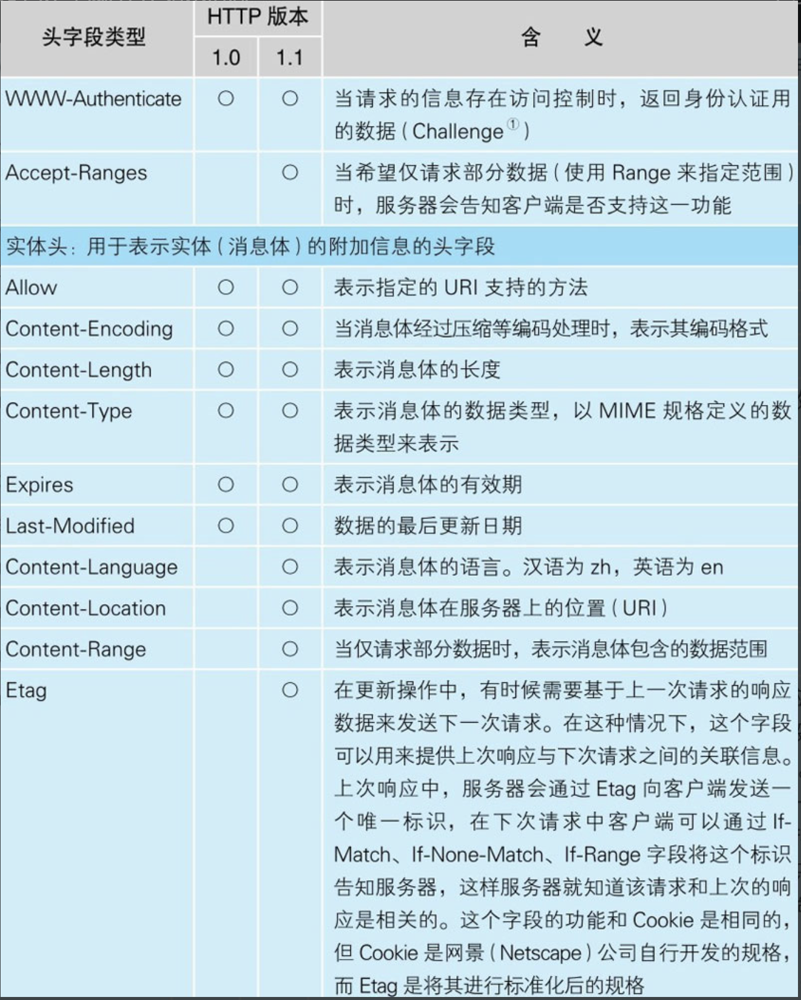

○：在规格中定义的项目。△：并非正式规格，而是在规格书附录（Appendix）中定义的附加功能。

### 响应

在响应消息中，第一行的内容为状态码和响应短语，用来表示请求的执行结果是成功还是出错。

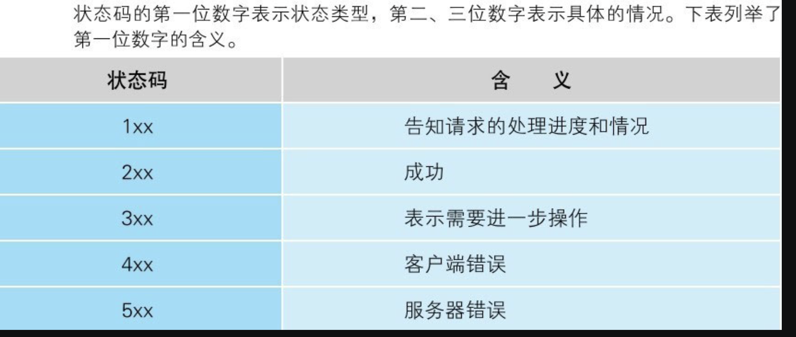

## 1.2 向DNS服务器查询Web服务器的IP地址

### IP 地址

操作系统将 HTTP 消息发送到网络前，必须要提供的不是通信对象的域名，而是它的IP地址。

TCP/IP的结构如图所示，就是由一些小的子网，通过路由器连接起来组成一个大的网络。这里的子网可以理解为用集线器连接起来的几台计算机，我们将它看作一个单位，称为子网。将子网通过路由器连接起来，就形成了一个网络。

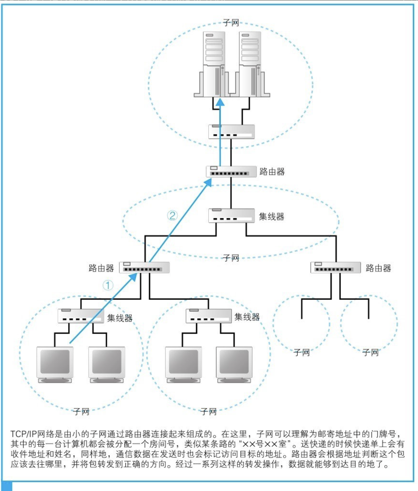

实际的IP地址是一串32比特的数字，按照8比特（1字节）为一组分成4组，分别用十进制表示然后再用圆点隔开。这就是我们平常经常见到的IP地址格式，但仅凭这一串数字我们无法区分哪部分是网络号，哪部分是主机号。

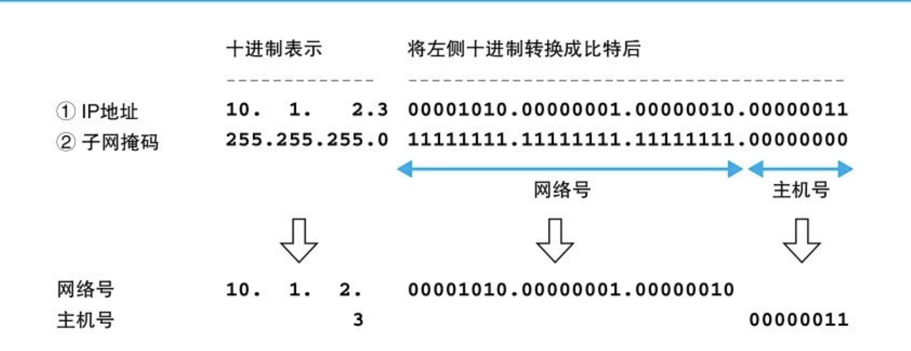

因此需要子网掩码来区分，子网掩码是一串与IP地址长度相同的32比特数字，其左边一半都是1，右边一半都是0。其中，子网掩码为1的部分表示网络号，子网掩码为0的部分表示主机号，如上图所示。

也可以把1的部分的比特数用十进制表示并写在IP地址的右侧，如下图 c 所示，其实和 b 的含义是一样的。

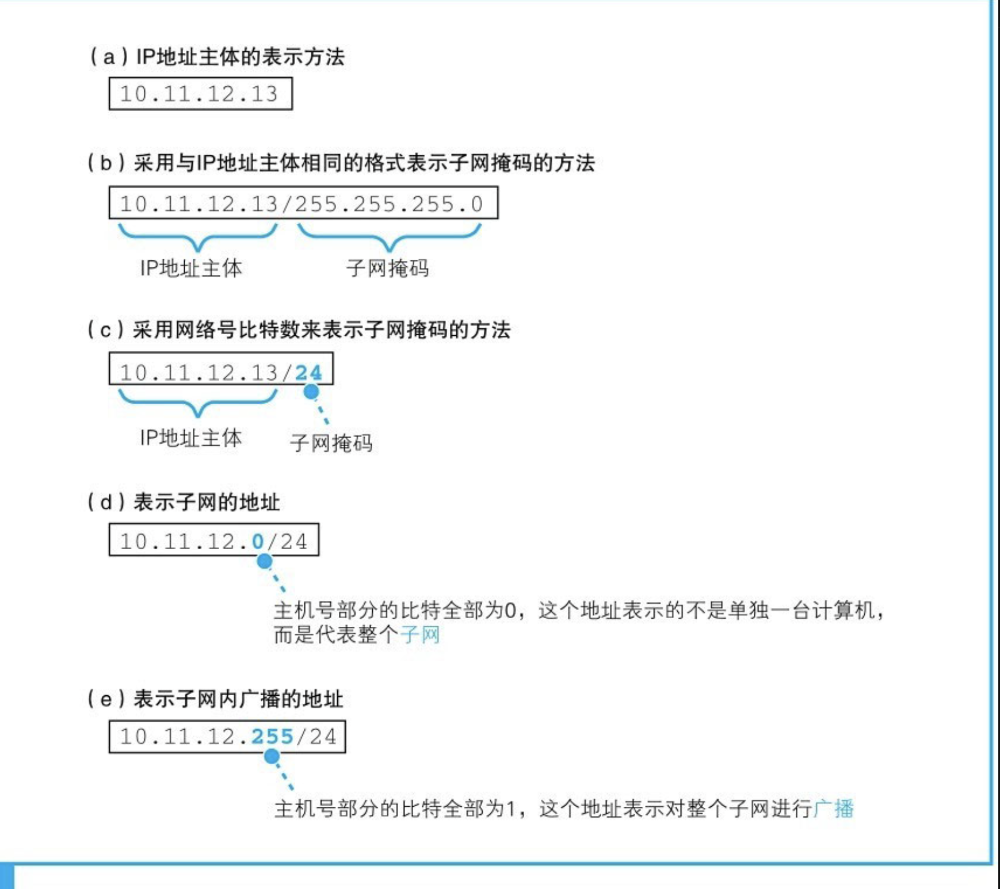

主机号部分的比特全部为0或者全部为1时代表两种特殊的含义。主机号部分全部为0代表整个子网而不是子网中的某台设备（上图（d））。此外，主机号部分全部为1代表向子网上所有设备发送包，即广播（上图（e））

### 解析器

域名解析（resolution）：通过DNS查询IP地址的操作。

解析器（resolver）：负责执行域名解析这一操作的程序，包含在操作系统的Socket库中供浏览器调用。

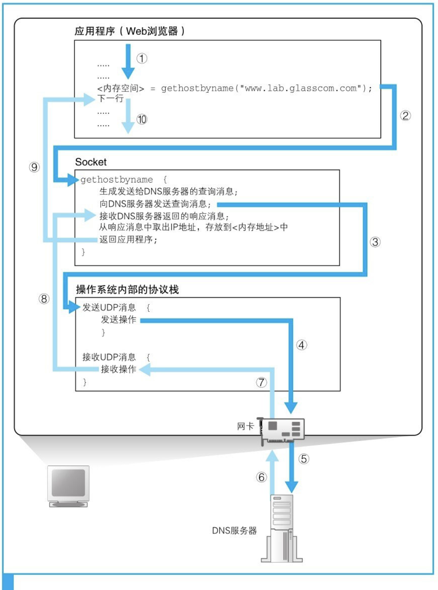

DNS 的 IP地址是作为TCP/IP的一个设置项目事先设置好的，不需要再去查询。不同的操作系统中TCP/IP的设置方法也有差异，Windows中的设置如图所示，解析器会根据这里设置的DNS服务器IP地址来发送消息。

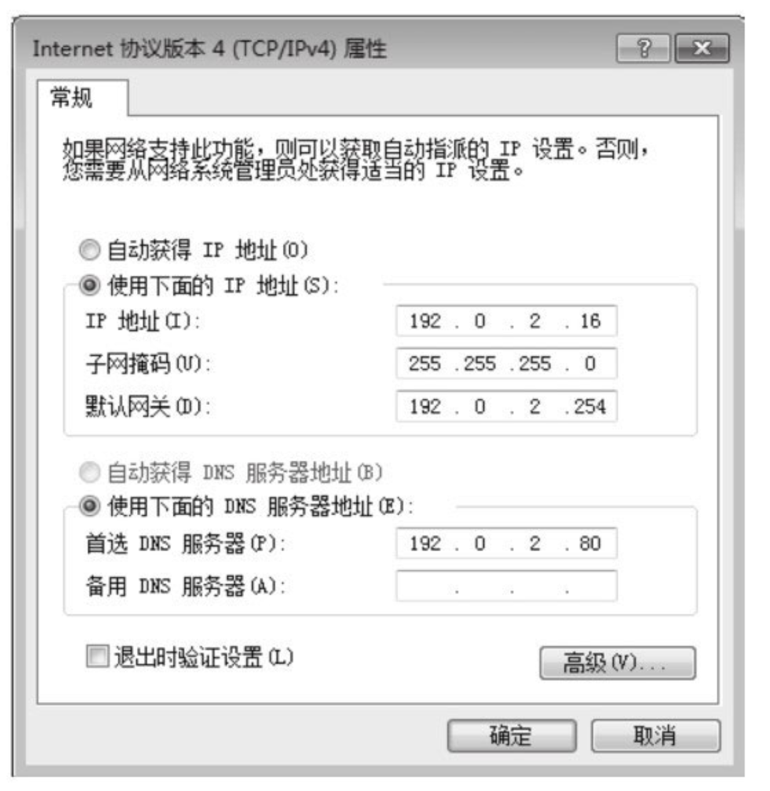

## 1.3 DNS 

### DNS 服务器的基本工作

来自客户端的查询消息：

1. 域名。
2. Class。用来识别网络的信息。不过，如今除了互联网并没有其他的网络了，因此 Class 的值永远是代表互联网的 “IN” 。
3. 记录类型。表示域名对应何种类型的记录。比如当类型为A时，表示域名对应的是IP地址；当类型为MX时，表示域名对应的是邮件服务器。对于不同的记录类型，服务器向客户端返回的信息也会不同

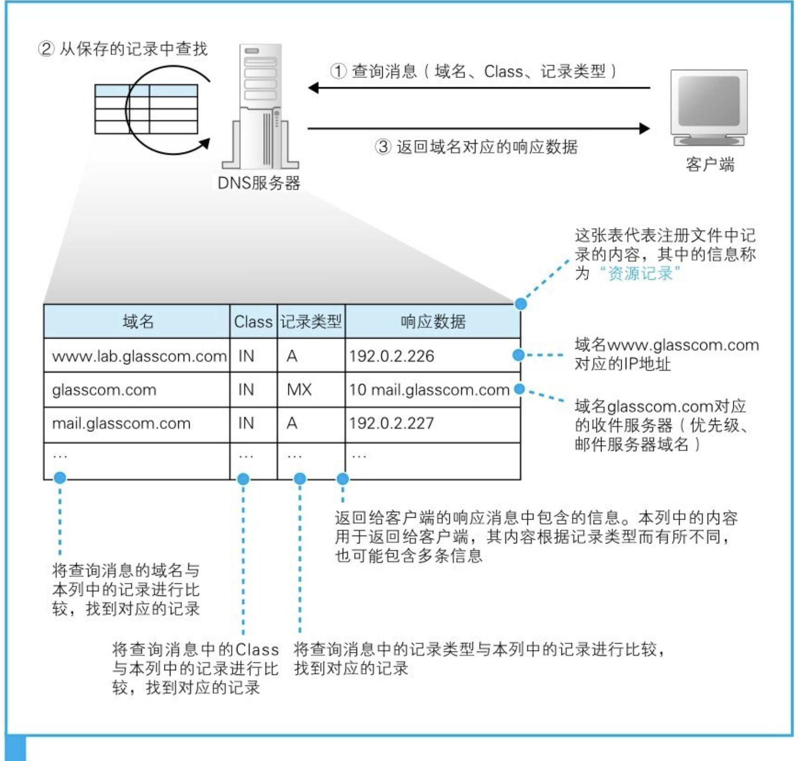

DNS服务器会从已有的记录中查找域名、Class和记录类型全部匹配的记录。

比如上图的第一条记录，匹配成功后就会返回域名的 ip 地址，即第一行的响应数据。

而如果是第二行邮件服务器的类型，响应数据会返回邮件服务器的域名和优先级。此外，MX 记录类型的返回消息还包括邮件服务器mail.glasscom.com 的 IP 地址。上表的第三行就是 mail.glasscom.com 的 IP 地址，因此只要用 mail.glasscom.com 的域名就可以找到这条记录。在这个例子中，我们得到的IP地址是192.0.2.227。

记录类型除了 A 和 MX 之外，还有其他类型，例如根据 IP 地址反查域名的 PTR 类型，查询域名相关别名的 CNAME 类型，查询 DNS 服务器 IP 地址的 NS 类型，以及查询域名属性信息的 SOA 类型等。

### 域名的层次结构

DNS 中的域名都是用句点来分隔的，比如 www.lab.glasscom.com，这里的句点代表了不同层次之间的界限，越靠右的位置表示其层级越高。因此，com 域的下一层是 glasscom 域，再下一层是 lab 域，再下面才是 www 这个名字。

一个域的信息是作为一个整体存放在 DNS 服务器中的，不能将一个域拆开来存放在多台 DNS 服务器中。而一台 DNS 服务器是可以存放多个域的。

我们可以在域的下面创建下级域，比如，假设公司的域为 example.co.jp，我们可以在这个域的下面创建两个子域，即 sub1. example.co.jp 和 sub2.example.co.jp ，然后就可以将这两个下级域分配给不同的事业集团来使用。其中最上层的 jp 代表分配给日本这个国家的域；下一层的 co 是日本国内进行分类的域，代表公司，以此类推。

### 寻找相应的DNS服务器并获取IP地址

我们会将负责管理下级域的 DNS 服务器的 IP 地址注册到它们的上级 DNS 服务器中，然后上级 DNS 服务器的 IP 地址再注册到更上一级的 DNS 服务器中，以此类推。

也就是说，负责管理 lab.glasscom.com 这个域的 DNS 服务器的 IP 地址需要注册到 glasscom.com 域的DNS服务器中，而glasscom.com 域的 DNS 服务器的 IP 地址又需要注册到 com 域的 DNS 服务器中。这样，我们就可以通过上级 DNS 服务器查询出下级  DNS 服务器的 IP 地址，也就可以向下级 DNS 服务器发送查询请求了。

互联网中 com 和 jp 上面还有一个**根域**，在网址里表示根域就是一个点，比如 www.lab.glasscom.com. 但一般会省略这个点。由于上级 DNS 服务器保管着所有下级 DNS 服务器的信息，所以我们可以**从根域开始一路往下顺藤摸瓜找到任意一个域的 DNS 服务器**。

**分配给根域 DNS 服务器的 IP 地址在全世界仅有 13 个**，而且这些地址基本不会变化。因此我们只要在任意一台 DNS 服务器上保存这些 IP 地址，就能找到根域 DNS 服务器，然后再依次找到目标 DNS 服务器。实际上，根域 DNS 服务器的相关信息已经包含在 DNS 服务器程序的配置文件中了，因此只要安装了 DNS 服务器程序，这些信息也就被自动配置好了。

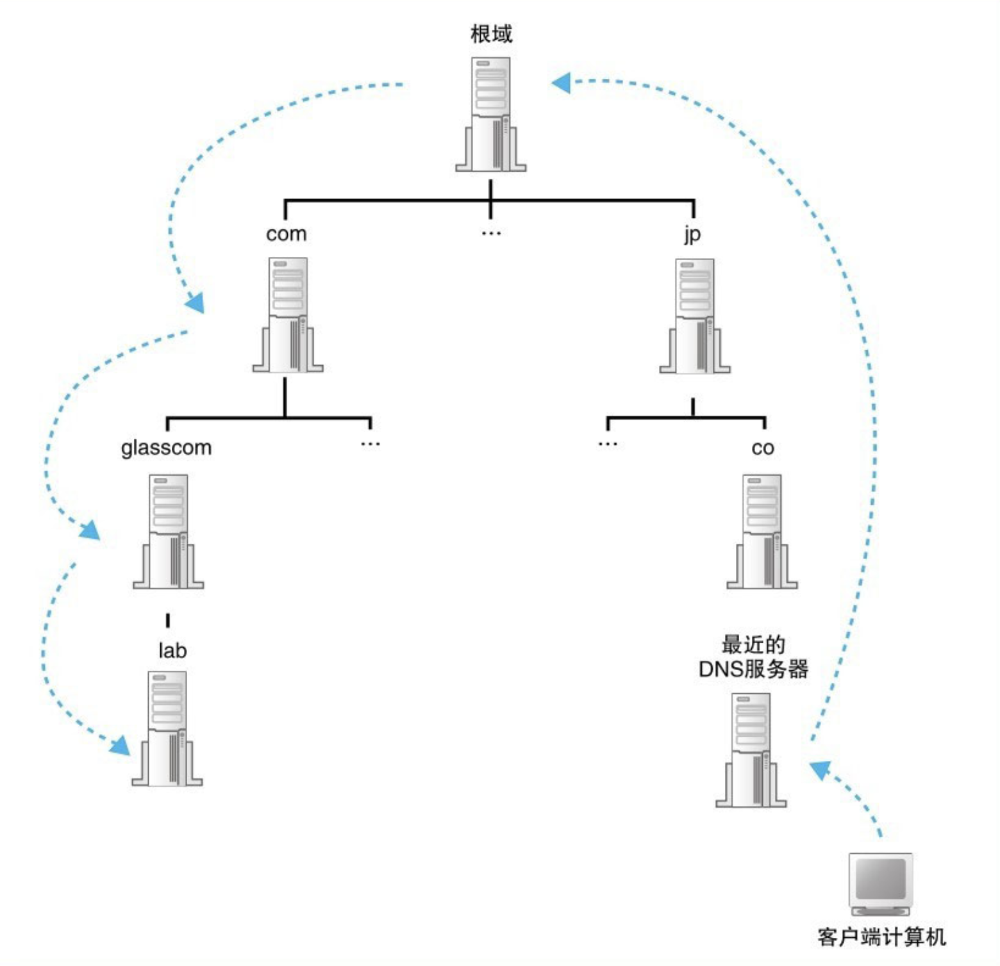

如上图所示，找到目标 DNS 服务器的步骤为：找到最近的 DNS 服务器 -> 根域 -> com 域服务器 -> glasscom.com 域服务器 -> lab.glasscom.com 域服务器地址。

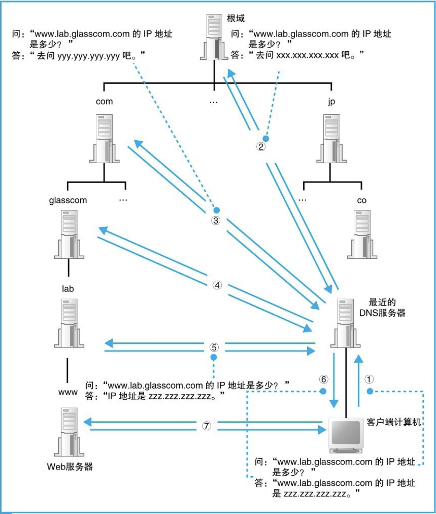

### 通过缓存加快DNS服务器的响应

现实中上级域和下级域有可能共享同一台 DNS 服务器。在这种情况下，访问上级 DNS 服务器时就可以向下跳过一级 DNS 服务器，直接返回再下一级 DNS 服务器的相关信息。

有时候并不需要从最上级的根域开始查找，因为 DNS 服务器有一个缓存功能，可以记住之前查询过的域名。如果要查询的域名和相关信息已经在缓存中，那么就可以直接返回响应，接下来的查询可以从缓存的位置开始向下进行。相比每次都从根域找起来说，缓存可以减少查询所需的时间。

并且，当要查询的域名不存在时，“不存在”这一响应结果也会被缓存。这样，当下次查询这个不存在的域名时，也可以快速响应。

这个缓存机制中有一点需要注意，那就是信息被缓存后，原本的注册信息可能会发生改变，这时缓存中的信息就有可能是不正确的。因此，DNS服务器中保存的信息都设置有一个**有效期**，当缓存中的信息超过有效期后，数据就会从缓存中删除。而且，在对查询进行响应时，DNS服务器也会告知客户端这一响应的结果是来自缓存中还是来自负责管理该域名的DNS服务器。

## 1.4 委托协议栈发送消息

###  数据收发操作

要发送给Web服务器的HTTP消息是一种数字信息（digital data），需要委托操作系统内部协议栈（其实就是 TCP 协议栈）来发送，按照指定的顺序来调用Socket库中的程序组件。

如下图所示，收发数据的两台计算机之间连接了一条数据通道，数据沿着这条通道流动，最终到达目的地。数据的流动是双向的。

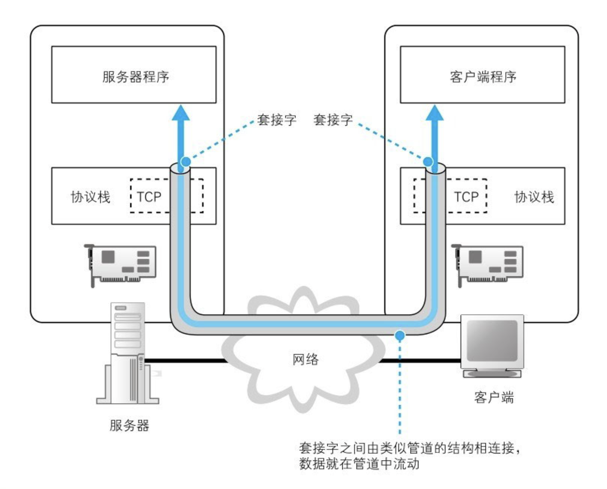

收发数据的操作分为若干个阶段：

1. 创建套接字（创建套接字阶段）
2. 将管道连接到服务器端的套接字上（连接阶段）
3. 收发数据（通信阶段）
4. 断开管道并删除套接字（断开阶段）

在每个阶段，Socket库中的程序组件都会被调用来执行相关的数据收发操作。

### 创建套接字阶段

流程：

1. 应用程序调用 socket 库创建 socket。
2. 创建 socket 成功会返回描述符。描述符是用来识别不同的套接字的。
3. 应用程序将描述符保存到内存中。之后向协议栈出示描述符，协议栈就知道需要用哪个 socket 来连接或收发数据了。

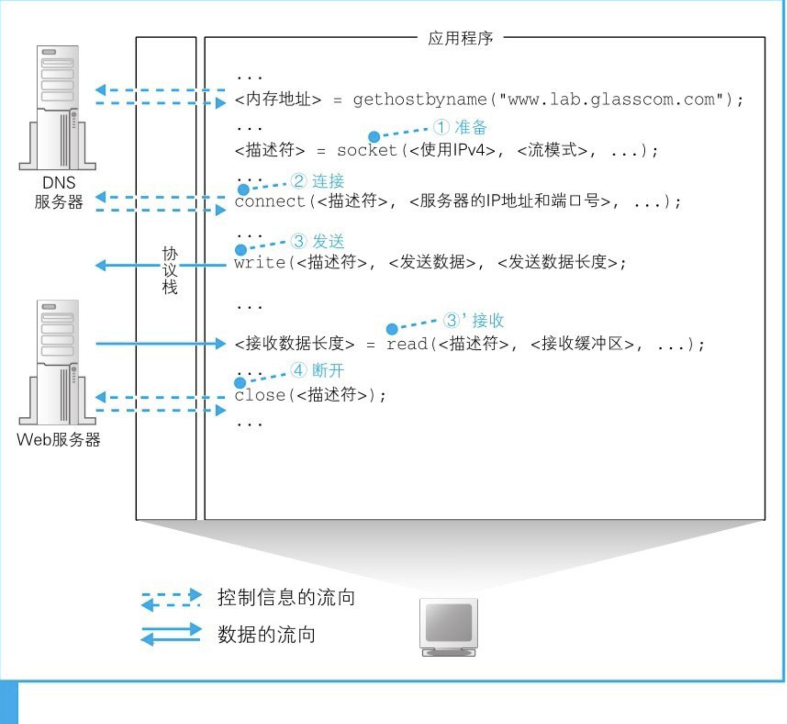

### 连接阶段

接下来，我们需要委托协议栈将客户端创建的套接字与服务器那边的套接字连接起来。就是调用 `connect(描述符，服务器的 IP 地址和端口号)` 方法。

描述符与端口号：

描述符是用来在一台**计算机内部**识别套接字的机制，那么端口号就是用来让**通信的另一方能够识别出套接字的机制**。即通过端口号，客户端就能知道，要连接服务器的哪个 socket 。

当连接成功后，协议栈会将对方的IP地址和端口号等信息保存在套接字中，这样我们就可以开始收发数据了。

### 通信阶段

发送消息：生成 HTTP 请求消息，调用 write 方法发送消息。

接收消息：调用 read 方法接收消息，需要指定一块用于存放接收到的响应消息的内存地址，这一内存地址称为接收缓冲区。

### 断开阶段

在 HTTP 1.0 中，当Web服务器发送完响应消息之后会调用 close 方法主动断开 TCP 连接。之后客户端浏览器通过 read 方法得知连接已断开，也会调用 close 方法断开连接，删除套接字。

在 HTTP 1.1 中，能够在一次连接中收发多个请求和响应，而不用频繁建立连接断开连接，当所有数据都请求完成后，浏览器才会主动触发断开连接的操作。这就是 keep-alive 机制。

## 总结

关键词：

HTTP 消息、 子网、IP 地址、子网掩码、DNS 解析器、DNS 服务器、域名层次结构、根域 DNS 服务器、通过 socket 建立连接收发消息。